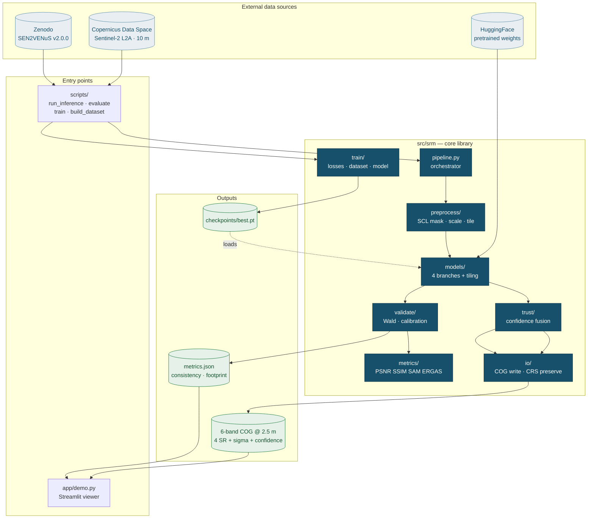
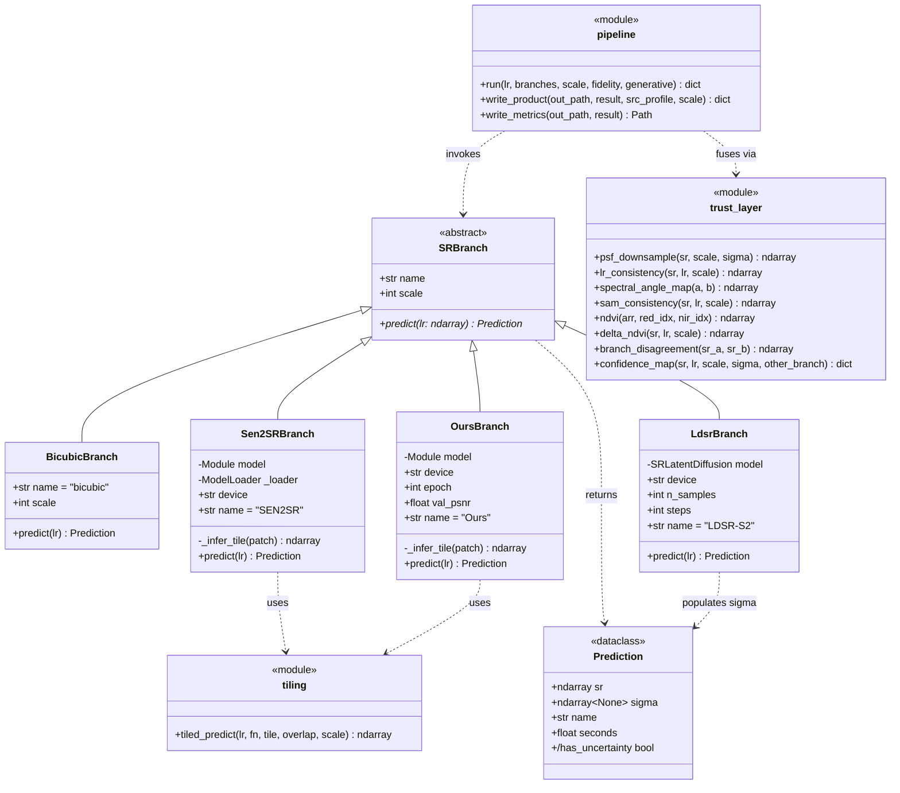
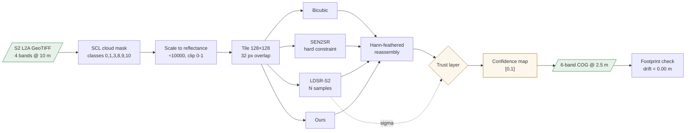
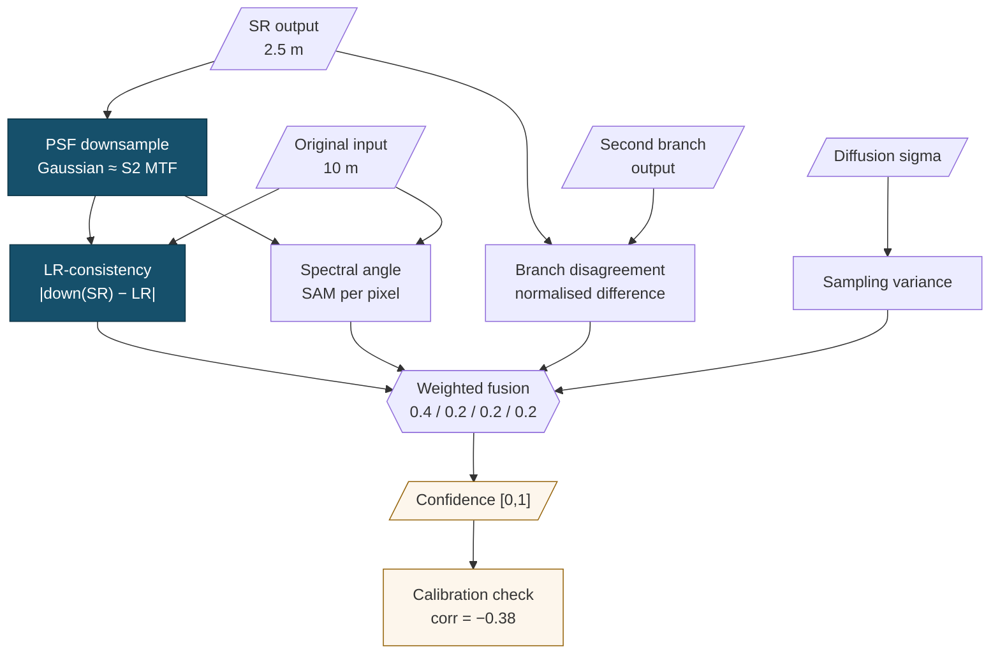
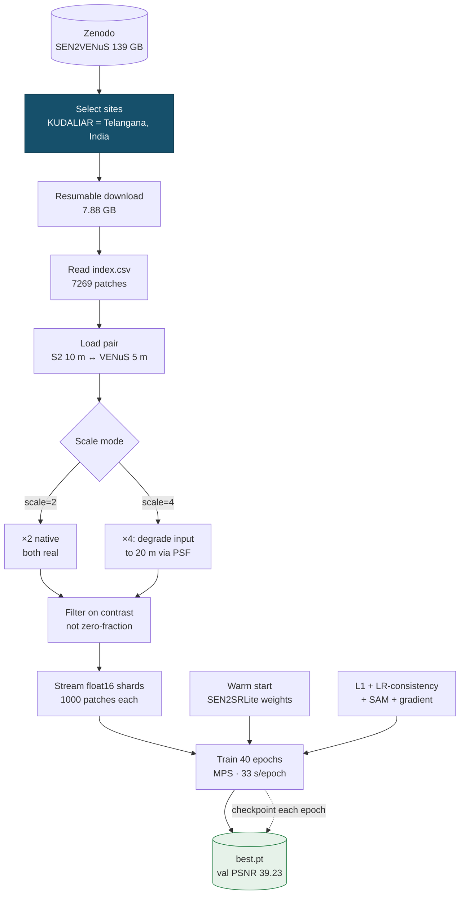
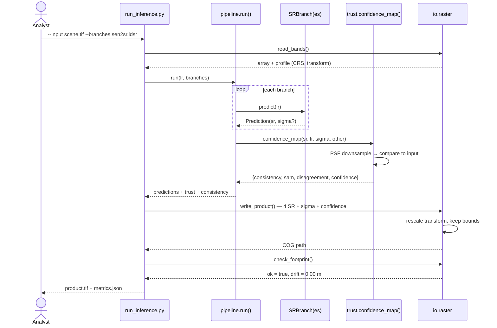
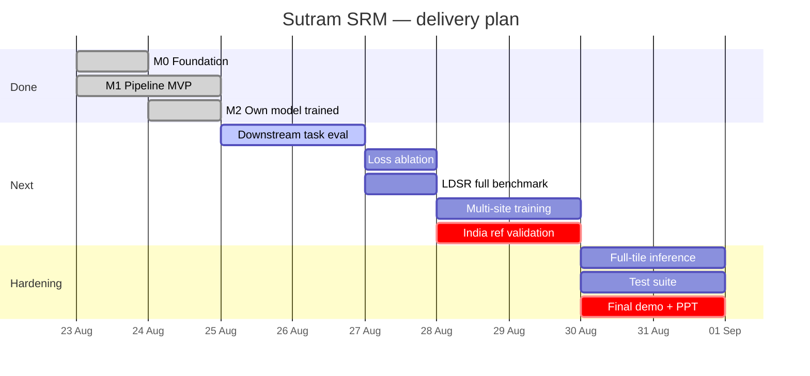

# Mermaid diagrams — Sutram SRM

Paste any block into <https://mermaid.live>, a GitHub `.md` file, Notion, or Obsidian.
For a PPT: render at mermaid.live → Actions → PNG/SVG → drop into the slide.

---

## 1. System architecture (component view)

---

## 2. UML class diagram (the branch abstraction)

This is the design decision that makes the system extensible: every model implements one
interface, so the pipeline, trust layer and evaluation harness need no special-casing.

Note the `<<module>>` stereotypes: `pipeline` and `trust.layer` are Python modules of
functions, not classes. Drawing them as classes would send a reviewer looking for types that
do not exist in the source.

---

## 3. Data flow (inference)

---

## 4. Trust layer detail

The four independent signals and how they fuse. LR-consistency is the only one that is
*physical* rather than learned — it asks whether the output survives being re-observed by
the sensor.

---

## 5. Training pipeline

---

## 6. Sequence — a single inference run

---

## 7. Development roadmap (Gantt)

